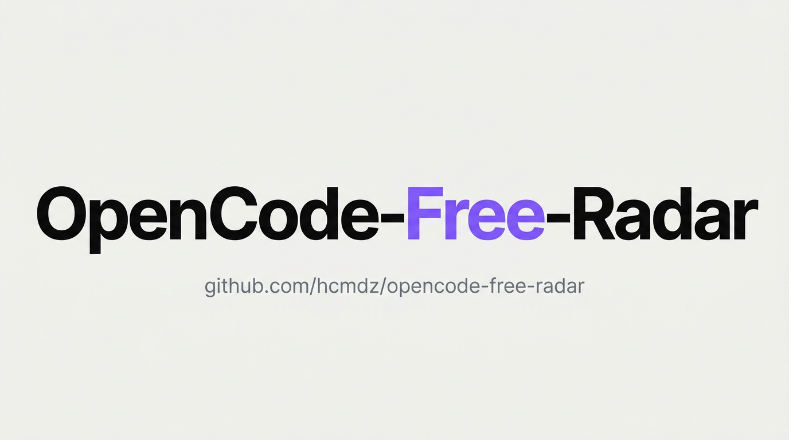
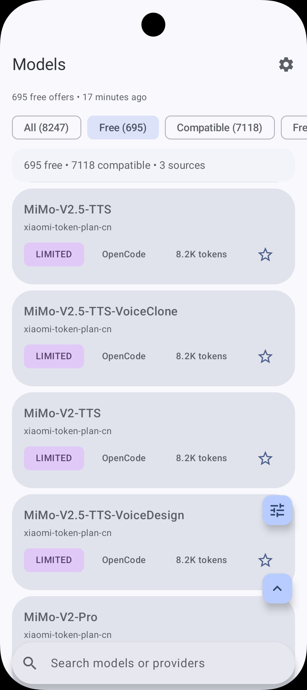
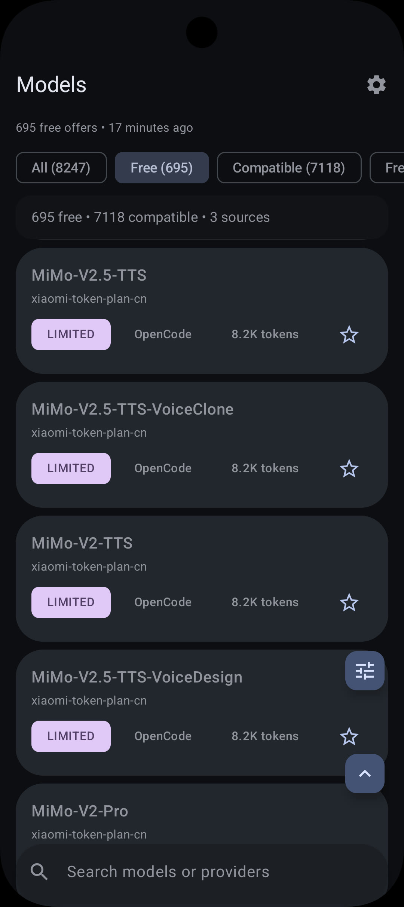
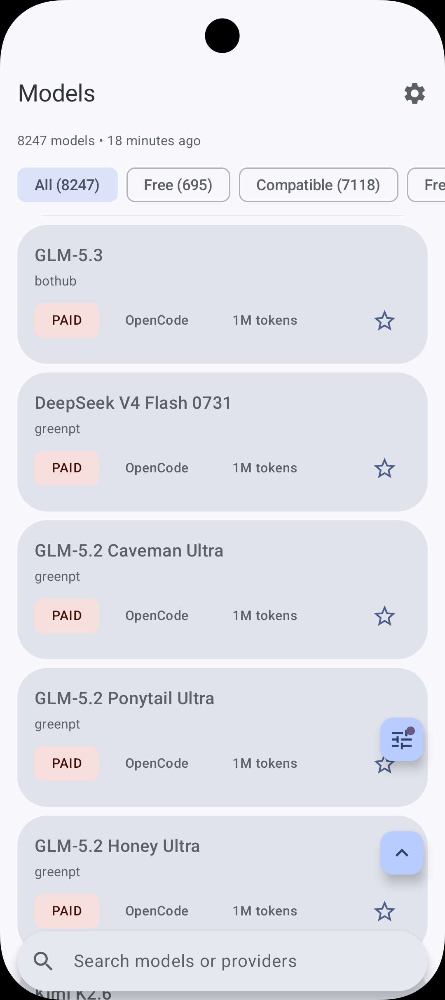
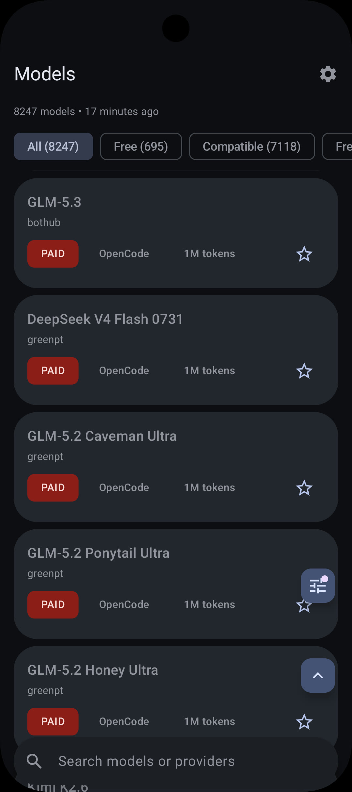
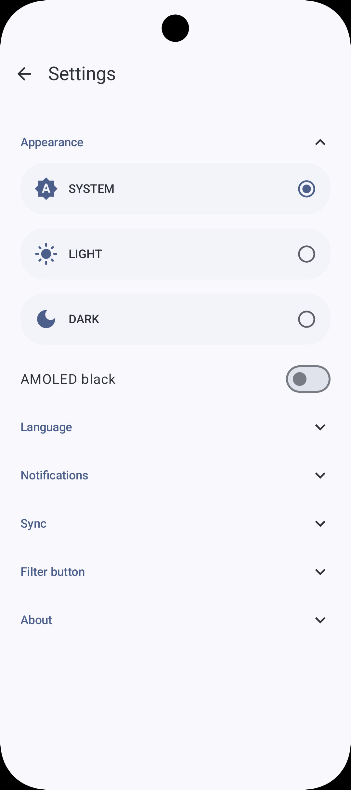
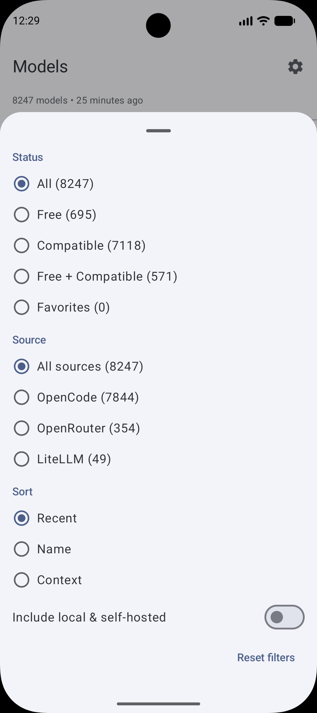

# OpenCode Free Radar

[](https://github.com/Hcmdz/OpenCode-Free-Radar/releases/latest)

[](https://www.android.com)
[](https://kotlinlang.org)
[](#)
[](#)
[](https://www.gnu.org/licenses/gpl-3.0)
[](https://github.com/Hcmdz/OpenCode-Free-Radar/releases/latest)
[](https://github.com/Hcmdz/OpenCode-Free-Radar/releases)
[](https://github.com/Hcmdz/OpenCode-Free-Radar/stargazers)
[](https://github.com/Hcmdz/OpenCode-Free-Radar/network/members)
[](https://developer.android.com/jetpack/compose)

Native Android app that tracks AI models free to use with
[OpenCode](https://opencode.ai) and notifies you when new free offers appear.

Free tiers appear and vanish without warning — a model that's free today is
paywalled tomorrow. OpenCode Free Radar is the offline-first watchtower: every
free offer tracked once, changes surfaced in seconds, history kept on device.

Unofficial community project — not affiliated with, endorsed, or sponsored
by Anomaly Innovations, Inc.

- **Package**: `com.opencode.freeradar`
- **Version**: 0.3.1
- **Author**: HcmDZ &lt;[REDACTED]&gt;

---

## 📦 Downloads

Get OpenCode Free Radar on GitHub: **[Latest release](https://github.com/Hcmdz/OpenCode-Free-Radar/releases/latest)** (`OFR-release.v0.3.1.apk`, ~4.1 MB).

- Requires Android 9+ (API 29); allow *Install unknown apps* for your browser when prompted.
- Verify integrity: `sha256sum -c OFR-release.v0.3.1.apk.sha256` (sidecar next to the APK).
- In-app updates check GitHub Releases daily and verify the SHA-256 before install.

---

## Features

### Catalog
- **Every free offer on record.** Daily catalog sync from public model indexes (models.dev, OpenRouter, LiteLLM price map, OpenCode Zen roster).
- **Only real free models.** Free views show confirmed offers only — first-party pricing or cross-source agreement. Unverified $0 rows and gated tiers stay out, silently.
- **Zen covered.** OpenCode Zen free trials tracked via the live roster and pricing doc, with expiry alerts; the opencode filter matches the Zen provider, not the pipeline.
- **Know what's actually usable.** Usable-free status per model (FREE / LIMITED / TRIAL / TEMPORARY); paid and expired offers filtered out.
- **Know what runs where.** OpenCode compatibility flags (tool calling, vision, reasoning).
- **Local stays local.** Third catalog source (LiteLLM) with local and self-hosted rows hidden by default behind a switch and marked with a Local pill.

### Sync & alerts
- **Never miss a new freebie.** Daily background sync via WorkManager; tapping an alert opens a snapshot card of new/expired offers.
- **Your data plan survives.** Wi-Fi-only mode, metered-data guard, and auto first sync on install.
- **History on device.** Price history and change log per model, stored on device.

### App
- **Your shortlist.** Favorites with dedicated filter, status/source views, sort by recent, name, or context.
- **Picks up where you left off.** Filters, sort, local switch, and recent searches persist across restarts.
- **Always up to date.** In-app updates via GitHub Releases (daily check, SHA-256 verified download).
- **Offline-first.** Room database, compact pinned top bar with count and sync age.
- **Speaks your language.** English, French, and Arabic UI with RTL layout support.
- **Looks at home.** Material 3 dynamic color with dark and high-contrast themes.

## Screenshots

Every free offer at a glance, light or dark — dashboard, filters, and settings.

| Light — free filter | Dark — free filter |
|---|---|
|  |  |
| Light — all models | Dark — offers list |
|  |  |
| Settings | Filter sheet |
|  |  |

Fine-tune sources, appearance, and sync behavior in one place.

## Tech stack

| Category | Library | Version |
|---|---|---|
| **Language** | Kotlin | 2.4.10 |
| **UI** | Jetpack Compose + Material 3 Expressive, Navigation 3 | BOM 2026.09.00 / Nav 1.1.7 |
| **Architecture** | Single `:app` module, MVI with StateFlow | — |
| **DI** | Koin | 4.2.2 (BOM) |
| **Database** | Room (source of truth) | 3.0.3 |
| **Networking** | Ktor + kotlinx.serialization | 3.5.2 / 1.11.0 |
| **Storage** | DataStore (settings) | 1.2.1 |
| **Scheduling** | WorkManager (daily sync) | 2.11.2 |
| **Image** | Coil | 3.6.2 |
| **Logging** | Kermit | 2.2.0 |
| **Async** | Kotlin Coroutines | 1.11.0 |
| **Testing** | JUnit 6 + Turbine + AssertK (unit), Compose UI tests + orchestrator (E2E) | 6.1.3 |
| **Build** | AGP 9.4.0, KSP 2.3.12, JDK 17, minSdk 29 / targetSdk 36 | — |

## Getting started

Prerequisites: JDK 17 and the Android SDK with platform 37.

```bash
git clone https://github.com/Hcmdz/OpenCode-Free-Radar.git
cd OpenCode-Free-Radar
./gradlew :app:assembleDebug
./gradlew :app:installDebug
```

Run checks:

```bash
./gradlew :app:testDebugUnitTest :app:lintDebug
./gradlew :app:connectedDebugAndroidTest   # needs a running emulator
```

## Testing

- Unit tests (JUnit 6 + Turbine + AssertK): `./gradlew :app:testDebugUnitTest`
- Static analysis: `./gradlew :app:lintDebug`
- UI tests on emulator (Compose + orchestrator):
  `./gradlew :app:connectedDebugAndroidTest`
- CI runs unit tests, lint, and CodeQL on every push/PR to `main`.

## Project structure

```text
app/src/main/java/com/opencode/freeradar/
├── data/            # Room DAOs/migrations, repository, remote sources (Ktor)
├── domain/          # Models, use cases (change detection, alerts), errors
├── ui/              # Compose screens, ViewModels, components, theme, navigation
├── worker/          # WorkManager daily sync (SyncWorker, SyncScheduler)
├── notifications/   # Alert channels and gates
└── di/              # Koin modules
docs/sources/        # Per-source notes (models.dev, OpenRouter, LiteLLM, Zen roster, rejected candidates)
```

## Contributing

See [CONTRIBUTING.md](CONTRIBUTING.md). Bug reports and feature ideas use the
issue templates; vulnerabilities follow [SECURITY.md](SECURITY.md). Please
respect the [Code of Conduct](CODE_OF_CONDUCT.md).

## Release signing

Release builds sign with your own keystore, which lives **outside** this
repository. Without it, every task still configures and debug builds work
fine, but the release output ships unsigned. To sign releases, add these keys
to `~/.gradle/gradle.properties` (outside any repo, values never committed):

```properties
RELEASE_STORE_FILE=<path-to-your-keystore>
RELEASE_STORE_[RELEASE_STORE_PASSWORD]
RELEASE_KEY_ALIAS=[ALIAS]
RELEASE_KEY_[RELEASE_KEY_PASSWORD]
```

Then run:

```bash
./gradlew :app:assembleRelease
```

---

## Changelog (v0.1.0 → v0.3.1)

### v0.3.1

- **Confirmed-only free views** — unverified $0 rows demote silently, gated tiers leave the free views, one shared confirmed-free definition
- **Zen free detection** — live roster × pricing doc fusion, synth rows for catalog lag, expiry alerts on trial end
- **Remembered filters** — dashboard filters, sort, local switch, and recent searches survive restarts
- **Pricing evidence** — Kenari $0 rows mapped to paid (IDR prepaid-wallet policy proven via models.dev history); evidence log in `docs/sources/models-dev-evidence.md`

### v0.3.0

- **Third catalog source** — LiteLLM price map with local/self-hosted rows hidden by default and marked with a Local pill
- **Stronger cross-check** — free models confirmed seen on both sources before alerting
- **Dashboard rework** — draggable floating filter button replaces the filter bar; one-tap status chips; compact token counts and pinned top bar; reset escape hatch for empty states; filter position is retained

### v0.2.0

- **In-app updates** — update check via GitHub Releases with sideload gated on host allowlist and unknown-sources consent
- **Data-sparing sync** — Wi-Fi-only mode, metered-data guard, auto first sync on install; unchanged catalogs skipped
- **Expressive redesign** — Material 3 Expressive overhaul with fullscreen content
- **Dashboard polish** — title bar, favorites filter, sort, loading skeleton; snapshot card opens on notification tap; sync age refreshes every minute
- **Build** — Room 3.0.3, Navigation 3 1.1.7

### v0.1.0

- **Initial release** — models.dev catalog source, multi-source sync with PARTIAL state and cross-check, OpenRouter source
- **Event notifications** — global toggle, 3 events, 1 summary per sync
- **Safe offline core** — Room v1→v2 with absence counter and absence-gated removal; degraded mode instead of catalog wipe on empty responses
- **App shell** — pull-to-refresh, collapsible settings, about section, adaptive launcher icon
- **Sources hygiene** — NVIDIA Build source dropped over website ToS; rejections documented in `docs/sources/`

---

## Privacy

All data stays on device. The app fetches the public model catalog over
HTTPS, stores it in a local Room database, and runs syncs in the background.
No account, no analytics, no third-party tracking SDK. Full policy:
https://hcmdz.github.io/OpenCode-Free-Radar/privacy/ and terms:
https://hcmdz.github.io/OpenCode-Free-Radar/terms/ — see also
[SECURITY.md](SECURITY.md) and [THIRD_PARTY.md](THIRD_PARTY.md).

## Legal

- [Terms of Service](https://hcmdz.github.io/OpenCode-Free-Radar/terms/)
- [Privacy Policy](https://hcmdz.github.io/OpenCode-Free-Radar/privacy/)

## License

Copyright holders are listed in the git history.
This program is free software under the GNU General Public License v3.0 or
later. See [LICENSE](LICENSE) for the full text.

## Related Docs

- [Contributing](CONTRIBUTING.md) · [Third-Party Components](THIRD_PARTY.md) · [Security](SECURITY.md) · [Code of Conduct](CODE_OF_CONDUCT.md)
- [Privacy Policy](https://hcmdz.github.io/OpenCode-Free-Radar/privacy/) · [Terms](https://hcmdz.github.io/OpenCode-Free-Radar/terms/) · [Sources](docs/sources/)

---

Made with ❤️ by HcmDZ
