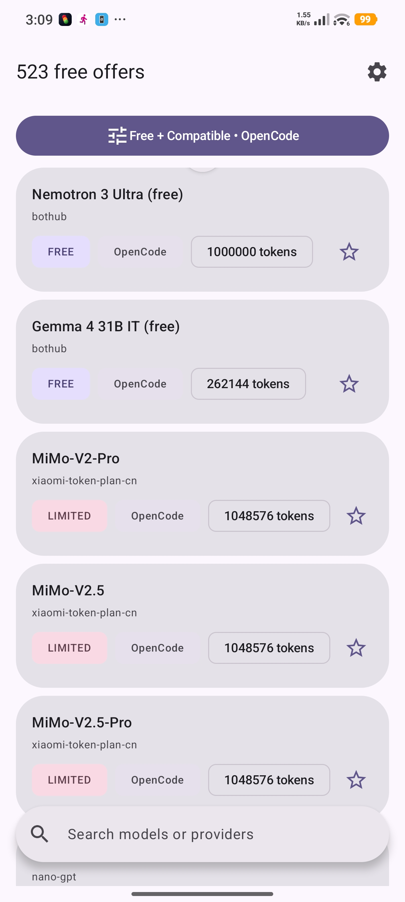
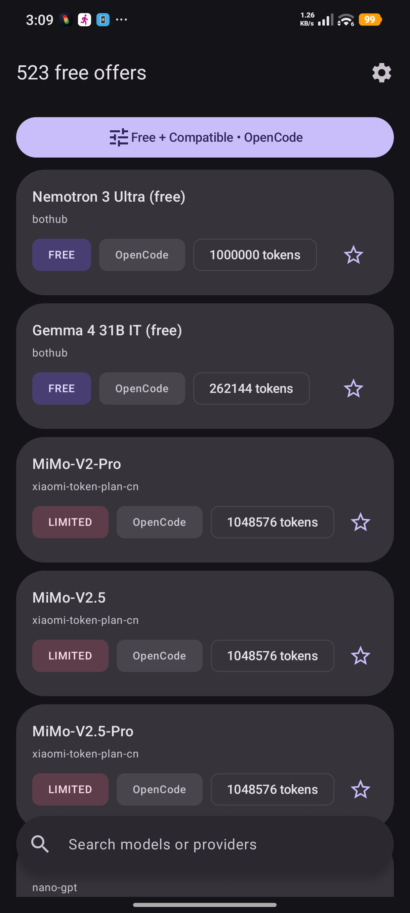
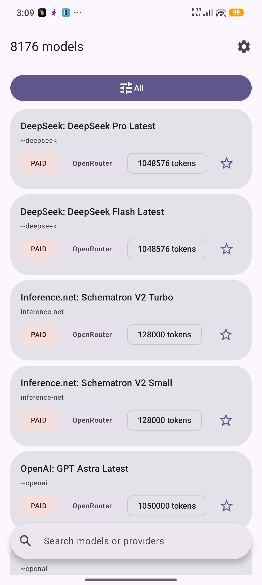
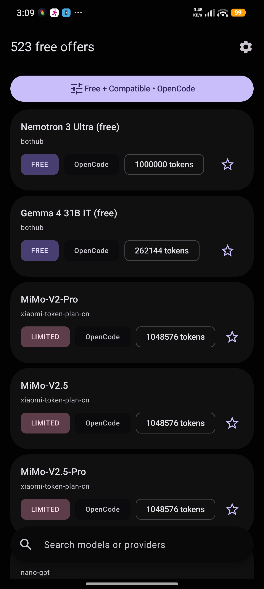

# OpenCode Free Radar

[](https://www.android.com)
[](https://kotlinlang.org)
[](#)
[](#)
[](https://www.gnu.org/licenses/gpl-3.0)

Native Android app that tracks AI models free to use with
[OpenCode](https://opencode.ai) and notifies you when new free offers appear.

Unofficial community project — not affiliated with, endorsed, or sponsored
by Anomaly Innovations, Inc.

## Features

- Daily catalog sync from public model indexes (models.dev, OpenRouter, OpenCode Zen roster)
- Usable-free status per model (FREE / LIMITED / TRIAL / TEMPORARY), paid and expired offers filtered out
- OpenCode compatibility flags (tool calling, vision, reasoning)
- Price history and change log per model, stored on device
- Favorites, filters, offline-first Room database
- Daily background sync via WorkManager, alerts on new freebies
- English, French, and Arabic UI with RTL layout support
- Material 3 dynamic color with dark and high-contrast themes

## Screenshots

| Light — free filter | Dark — free filter |
|---|---|
|  |  |
| Light — all models | Dark — offers list |
|  |  |

## Tech stack

- Kotlin 2.4.10, Jetpack Compose + Material 3 Expressive
- Single `:app` module, MVI with StateFlow, Navigation 3
- Koin (DI), Room 3.0 (source of truth), Ktor (network)
- DataStore (settings), WorkManager (daily sync)
- JUnit 5 + Turbine + AssertK (unit), Compose UI tests + orchestrator (E2E)
- minSdk 29, targetSdk 36, JDK 17, AGP 9.4.0

## Getting started

Prerequisites: JDK 17 and the Android SDK with platform 37.

```bash
git clone https://github.com/Hcmdz/OpenCode-Free-Radar.git
cd OpenCode-Free-Radar
./gradlew :app:assembleDebug
./gradlew :app:installDebug
```

Run checks:

```bash
./gradlew :app:testDebugUnitTest :app:lintDebug
./gradlew :app:connectedDebugAndroidTest   # needs a running emulator
```

## Testing

- Unit tests (JUnit 5 + Turbine + AssertK): `./gradlew :app:testDebugUnitTest`
- Static analysis: `./gradlew :app:lintDebug`
- UI tests on emulator (Compose + orchestrator):
  `./gradlew :app:connectedDebugAndroidTest`
- CI runs unit tests, lint, and CodeQL on every push/PR to `main`.

## Project structure

```text
app/src/main/java/com/opencode/freeradar/
├── data/            # Room DAOs/migrations, repository, remote sources (Ktor)
├── domain/          # Models, use cases (change detection, alerts), errors
├── ui/              # Compose screens, ViewModels, components, theme, navigation
├── worker/          # WorkManager daily sync (SyncWorker, SyncScheduler)
├── notifications/   # Alert channels and gates
└── di/              # Koin modules
docs/sources/        # Per-source notes (models.dev, OpenRouter, Zen roster)
```

## Contributing

See [CONTRIBUTING.md](CONTRIBUTING.md). Bug reports and feature ideas use the
issue templates; vulnerabilities follow [SECURITY.md](SECURITY.md). Please
respect the [Code of Conduct](CODE_OF_CONDUCT.md).

## Release signing

Release builds sign with your own keystore, which lives **outside** this
repository. Without it, every task still configures and debug builds work
fine, but the release output ships unsigned. To sign releases, add these keys
to `~/.gradle/gradle.properties` (outside any repo, values never committed):

```properties
RELEASE_STORE_FILE=<path-to-your-keystore>
RELEASE_STORE_[RELEASE_STORE_PASSWORD]
RELEASE_KEY_ALIAS=[ALIAS]
RELEASE_KEY_[RELEASE_KEY_PASSWORD]
```

Then run:

```bash
./gradlew :app:assembleRelease
```

## Privacy

All data stays on device. The app fetches the public model catalog over
HTTPS, stores it in a local Room database, and runs syncs in the background.
No account, no analytics, no third-party tracking SDK. Full policy:
https://hcmdz.github.io/OpenCode-Free-Radar/privacy/ and terms:
https://hcmdz.github.io/OpenCode-Free-Radar/terms/ — see also
[SECURITY.md](SECURITY.md) and [THIRD_PARTY.md](THIRD_PARTY.md).

## License

Copyright holders are listed in the git history.
This program is free software under the GNU General Public License v3.0 or
later. See [LICENSE](LICENSE) for the full text.
