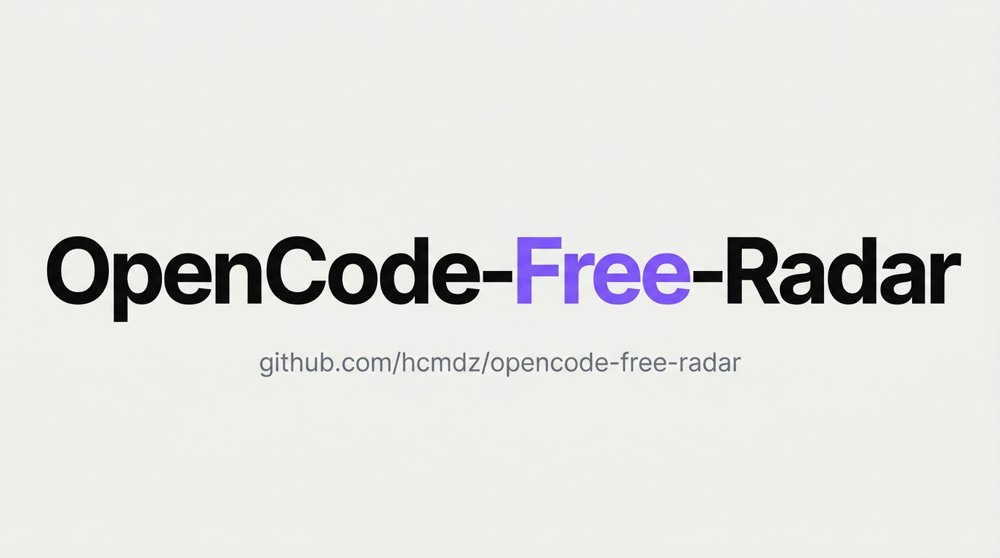
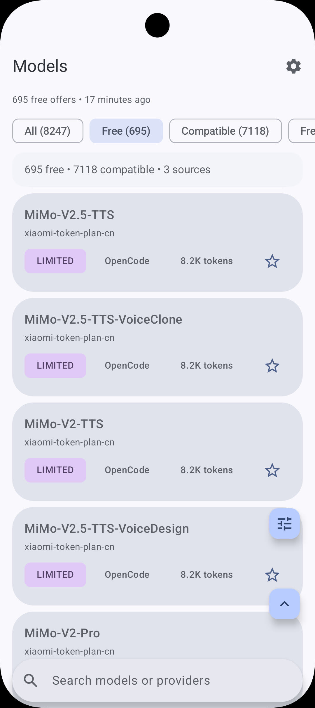
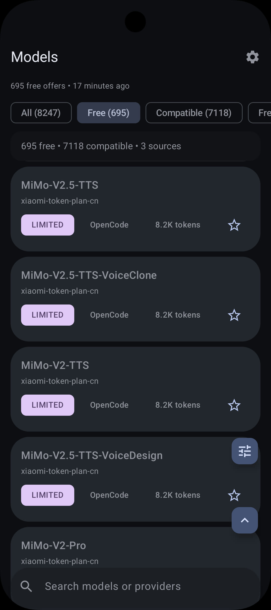
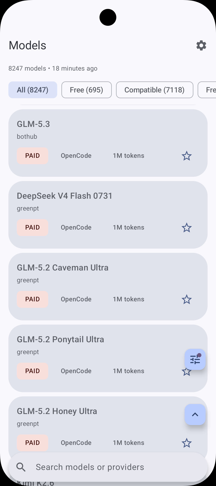
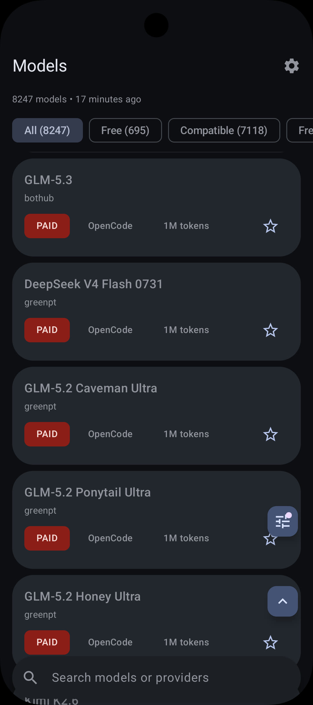
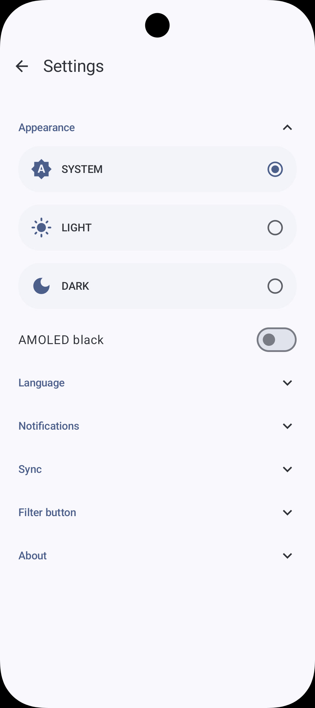
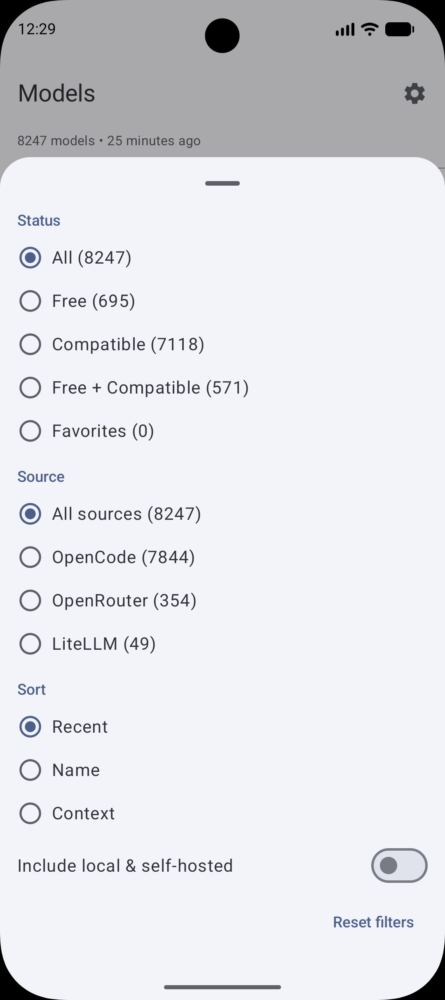

# OpenCode Free Radar
<a id="readme-top"></a>

[](https://github.com/Hcmdz/OpenCode-Free-Radar/releases/latest)

<div align="center">
   <a href="https://github.com/Hcmdz/OpenCode-Free-Radar/releases">
      
   </a>
   <a href="https://apps.obtainium.imranr.dev/redirect?r=obtainium://add/https://github.com/Hcmdz/OpenCode-Free-Radar/">
      
   </a>
</div>

<br />

[](https://www.android.com)
[](https://kotlinlang.org)
[](#)
[](#)
[](https://www.gnu.org/licenses/gpl-3.0)
[](https://github.com/Hcmdz/OpenCode-Free-Radar/releases/latest)
[](https://github.com/Hcmdz/OpenCode-Free-Radar/releases)
[](https://github.com/Hcmdz/OpenCode-Free-Radar/stargazers)
[](https://github.com/Hcmdz/OpenCode-Free-Radar/network/members)
[](https://developer.android.com/jetpack/compose)

Native Android app that tracks AI models free to use with
[OpenCode](https://opencode.ai) and notifies you when new free offers appear.

Free tiers appear and vanish without warning — a model that's free today is
paywalled tomorrow. OpenCode Free Radar is the offline-first watchtower: every
free offer tracked once, changes surfaced in seconds, history kept on device.

Unofficial community project — not affiliated with, endorsed, or sponsored
by Anomaly Innovations, Inc.

<p align="center">
  <a href="#screenshots">View Demo</a>
  ·
  <a href="https://github.com/Hcmdz/OpenCode-Free-Radar/issues/new?labels=bug">Report Bug</a>
  ·
  <a href="https://github.com/Hcmdz/OpenCode-Free-Radar/issues/new?labels=enhancement">Request Feature</a>
</p>

- **Package**: `com.opencode.freeradar`
- **Version**: 0.4.2 (versionCode 40200)
- **Author**: HcmDZ &lt;[HcmDz.Dev@gmail.com]&gt;

<details>
<summary>Table of Contents</summary>

- [📦 Downloads](#-downloads)
- [Features](#features)
- [Screenshots](#screenshots)
- [Tech stack](#tech-stack)
- [Getting started](#getting-started)
- [Testing](#testing)
- [Project structure](#project-structure)
- [Contributing](#contributing)
- [Release signing](#release-signing)
- [APK size](#-apk-size)
- [Changelog](#changelog-v010--v042)
- [Privacy](#privacy)
- [Legal](#legal)
- [License](#license)
- [Roadmap](#️-roadmap)
- [Related Docs](#related-docs)
- [Contact](#-contact)
</details>

---

## 📦 Downloads

Get OpenCode Free Radar on GitHub: **[Latest release](https://github.com/Hcmdz/OpenCode-Free-Radar/releases/latest)** (`OFR-release.v0.4.2.apk`, ~4.3 MB, universal APK).

- Requires Android 10+ (API 29); allow *Install unknown apps* for your browser when prompted.
- Architectures: `arm64-v8a`, `armeabi-v7a`, `x86`, `x86_64` (one APK, no per-ABI download).
- Verify integrity: `sha256sum -c OFR-release.v0.4.2.apk.sha256` (sidecar next to the APK).
- In-app updates check GitHub Releases daily and verify the SHA-256 before install.
- A signing-key change would require uninstalling before reinstalling: Android refuses in-place updates across certificates.

<p align="right">(<a href="#readme-top">back to top</a>)</p>

---

## Features

### Catalog
- **Every free offer on record.** Daily catalog sync from public model indexes (models.dev, OpenRouter, LiteLLM price map, OpenCode Zen roster).
- **Only real free models.** Free views show confirmed offers only — first-party pricing or cross-source agreement. Unverified $0 rows and gated tiers stay out, silently.
- **Zen covered.** OpenCode Zen free trials tracked via the live roster and pricing doc, with expiry alerts; the opencode filter matches the Zen provider, not the pipeline.
- **Know what's actually usable.** Usable-free status per model (FREE / LIMITED / TRIAL / TEMPORARY); paid and expired offers filtered out.
- **Know what runs where.** OpenCode compatibility flags (tool calling, vision, reasoning).
- **Local stays local.** Third catalog source (LiteLLM) with local and self-hosted rows hidden by default behind a switch and marked with a Local pill.

### Sync & alerts
- **Never miss a new freebie.** Background sync via WorkManager; tapping an alert opens a snapshot card of new/expired offers.
- **You set the rhythm.** Auto-sync on Wi-Fi, Wi-Fi on battery, battery only, or always, with a cadence from 8 to 72 hours; the choice survives restarts.
- **Your data plan survives.** Metered-data guard, auto first sync on install, and alerts enabled by default with a one-time permission prompt.
- **History on device.** Price history and change log per model, stored on device.

### App
- **Your shortlist.** Favorites with dedicated filter, status/source views, sort by recent, name, or context; a starred model stays pinned above the active sort.
- **Picks up where you left off.** Filters, sort, local switch, and recent searches persist across restarts.
- **Always up to date.** In-app updates via GitHub Releases (daily check, SHA-256 verified download).
- **Offline-first.** Room database, compact pinned top bar with count and sync age.
- **Speaks your language.** English, French, and Arabic UI with RTL layout support.
- **Looks at home.** Material 3 dynamic color with dark and high-contrast themes.

<p align="right">(<a href="#readme-top">back to top</a>)</p>

## Screenshots

Every free offer at a glance, light or dark — dashboard, filters, and settings.

| Light — free filter | Dark — free filter |
|---|---|
|  |  |
| Light — all models | Dark — offers list |
|  |  |
| Settings | Filter sheet |
|  |  |

Fine-tune sources, appearance, and sync behavior in one place.

<p align="right">(<a href="#readme-top">back to top</a>)</p>

## Tech stack

| Category | Library | Version |
|---|---|---|
| **Language** | Kotlin | 2.4.20 |
| **UI** | Jetpack Compose + Material 3 Expressive, Navigation 3, Material Kolor (dynamic color) | BOM 2026.09.01 / Nav 1.1.7 / Kolor 5.0.1 |
| **Architecture** | Single `:app` module, MVI with StateFlow | — |
| **DI** | Koin | 4.2.2 (BOM) |
| **Database** | Room (source of truth) | 3.0.3 |
| **Networking** | Ktor + kotlinx.serialization | 3.6.0 / 1.11.0 |
| **Storage** | DataStore (settings) | 1.2.1 |
| **Scheduling** | WorkManager (configurable sync) | 2.12.0 |
| **Async** | Kotlin Coroutines | 1.11.0 |
| **Testing** | JUnit 6 + Turbine + AssertK (unit), Compose UI tests + orchestrator (E2E) | 6.1.3 / 1.2.1 / 0.28.1 |
| **Build** | AGP 9.4.1, KSP 2.3.12, JDK 17, minSdk 29 / targetSdk 36 | — |

<p align="right">(<a href="#readme-top">back to top</a>)</p>

## Getting started

Prerequisites: JDK 17 ([Gradle toolchain](https://docs.gradle.org/current/userguide/build_java_projects.html)) and the Android SDK with API 37 minor 1 (`compileSdk 37` + `compileSdkMinor 1`; [install](https://developer.android.com/studio#downloads)).

### Installation

```bash
git clone https://github.com/Hcmdz/OpenCode-Free-Radar.git
cd OpenCode-Free-Radar
./gradlew :app:assembleDebug
./gradlew :app:installDebug
```

### Everyday use

```bash
./gradlew :app:installDebug          # run on device
./gradlew :app:testDebugUnitTest     # unit tests
./gradlew :app:lintDebug             # static analysis
```

Run checks:

```bash
./gradlew :app:testDebugUnitTest :app:lintDebug
./gradlew :app:connectedDebugAndroidTest   # needs a running emulator
```

## Testing

- Unit tests (JUnit 6 + Turbine + AssertK): `./gradlew :app:testDebugUnitTest`
- Static analysis: `./gradlew :app:lintDebug`
- UI tests on emulator (Compose + orchestrator):
  `./gradlew :app:connectedDebugAndroidTest`
- CI runs unit tests, lint, and CodeQL on every push/PR to `main`; instrumented tests run locally on an emulator.

### CI & Quality

- GitHub Actions: `.github/workflows/ci.yml` (unit tests, lint, English-only language gate, gitleaks secret scan + sensitive-filename gate), `codeql.yml`, Dependabot (weekly, grouped).
- Required CI variable **names** (values stay in repo/environment secrets, never committed): release keystore credentials (`RELEASE_STORE_FILE`, `RELEASE_STORE_PASSWORD`, `RELEASE_KEY_ALIAS`, `RELEASE_KEY_PASSWORD`).

## Permissions

- `INTERNET`, `ACCESS_NETWORK_STATE` — catalog sync (Ktor) and update check.
- `POST_NOTIFICATIONS` — new/expired offer alerts.
- `REQUEST_INSTALL_PACKAGES` — in-app update install.

Entry points: `RadarApp` (Application), `MainActivity` (launcher).

## Security

| Control | Implementation |
|---|---|
| **Network security** | Cleartext blocked (`network_security_config.xml`); user CAs trusted in debug builds only |
| **Backup disabled** | `allowBackup="false"` |
| **Update integrity** | Pinned `api.github.com` metadata, HTTPS-only download host allowlist, SHA-256 compared against the digest in the release body (skipped when the release carries none) |
| **Log hygiene** | R8 log stripping in release builds |

## Project structure

```text
app/src/main/java/com/opencode/freeradar/
├── data/            # Room DAOs/migrations, repository, remote sources (Ktor)
├── domain/          # Models, use cases (change detection, alerts), errors
├── ui/              # Compose screens, ViewModels, components, theme, navigation
├── worker/          # WorkManager daily sync (SyncWorker, SyncScheduler)
├── notifications/   # Alert channels and gates
├── util/            # UpdateManager (in-app updates), NetworkMonitor, Hash
└── di/              # Koin modules
docs/sources/        # Per-source notes (models.dev, OpenRouter, LiteLLM, Zen roster, rejected candidates)
```

## Contributing

See [CONTRIBUTING.md](CONTRIBUTING.md). Bug reports and feature ideas use the
issue templates; vulnerabilities follow [SECURITY.md](SECURITY.md). Please
respect the [Code of Conduct](CODE_OF_CONDUCT.md).

## Release signing

Release builds sign with your own keystore, which lives **outside** this
repository. Without it, every task still configures and debug builds work
fine, but the release output ships unsigned. To sign releases, add these keys
to `~/.gradle/gradle.properties` (outside any repo, values never committed):

```properties
RELEASE_STORE_FILE=<path-to-your-keystore>
RELEASE_STORE_[RELEASE_STORE_PASSWORD]
RELEASE_KEY_ALIAS=[ALIAS]
RELEASE_KEY_[RELEASE_KEY_PASSWORD]
```

Then run:

```bash
./gradlew :app:assembleRelease
```

<p align="right">(<a href="#readme-top">back to top</a>)</p>

## 📏 APK Size

Release APK: **~4.3 MB** compressed (4,503,419 bytes), 133 entries, one universal binary.

| Component | Uncompressed |
|---|---|
| `classes.dex` (app + libraries, R8-shrunk) | ~3.9 MB |
| Resources and assets | ~232 KB |
| Packaging metadata (`resources.arsc`, Kotlin builtins) | ~202 KB |
| Signature (`META-INF`) | ~92 KB |
| Native libraries (4 ABIs) | ~70 KB |

The launcher icon artwork is the largest single resource (~166 KB): the radar
render is a photographic-style gradient, which PNG compresses poorly.

Release builds run `isMinifyEnabled` with `isShrinkResources`, which collapses the
library graph into a single dex. There is no ABI filtering: one APK covers
`arm64-v8a`, `armeabi-v7a`, `x86`, and `x86_64` rather than shipping per-architecture
downloads.

<p align="right">(<a href="#readme-top">back to top</a>)</p>

---

## Changelog (v0.1.0 → v0.4.2)

Versions follow [semver](https://semver.org/); full history lives in [GitHub Releases](https://github.com/Hcmdz/OpenCode-Free-Radar/releases).

### v0.4.2

- **In-app updates install again** — the APK downloaded and then nothing happened: no prompt, no error, no crash. The install session was committed with an immutable status receiver, which the platform rejects outright. The confirmation prompt now appears

### v0.4.1

- **Expiry alerts on their own switch** — "Alert me about new free offers" no longer bundles expiry alerts; a second toggle follows new freebies without pinging you when an offer turns paid or lapses. On by default, so existing installs keep today's behaviour
- **New launcher icon** — the radar artwork is redrawn as a full-bleed adaptive icon, and a line-art monochrome layer keeps themed icons working on Android 13+

### v0.4.0

- **Auto-sync on a schedule** — pick the network constraint (Wi-Fi, Wi-Fi on battery, battery only, always) and the cadence from 8 to 72 hours; the choice survives restarts
- **Alerts on by default** — a sync that spots new free models raises a notification, and the permission is asked once at first launch instead of being buried in settings
- **Favorites pinned to the top** — a starred model stays above the rest of the list whatever sort is active, and models tied on the same key keep a stable order
- **Self-update repaired** — the in-app update flow installs the new build again and reports the outcome correctly

### v0.3.1

- **Confirmed-only free views** — unverified $0 rows demote silently, gated tiers leave the free views, one shared confirmed-free definition
- **Zen free detection** — live roster × pricing doc fusion, synth rows for catalog lag, expiry alerts on trial end
- **Remembered filters** — dashboard filters, sort, local switch, and recent searches survive restarts
- **Pricing evidence** — Kenari $0 rows mapped to paid (IDR prepaid-wallet policy proven via models.dev history); evidence log in `docs/sources/models-dev-evidence.md`

### v0.3.0

- **Third catalog source** — LiteLLM price map with local/self-hosted rows hidden by default and marked with a Local pill
- **Stronger cross-check** — free models confirmed seen on both sources before alerting
- **Dashboard rework** — draggable floating filter button replaces the filter bar; one-tap status chips; compact token counts and pinned top bar; reset escape hatch for empty states; filter position is retained

### v0.2.0

- **In-app updates** — update check via GitHub Releases with sideload gated on host allowlist and unknown-sources consent
- **Data-sparing sync** — Wi-Fi-only mode, metered-data guard, auto first sync on install; unchanged catalogs skipped
- **Expressive redesign** — Material 3 Expressive overhaul with fullscreen content
- **Dashboard polish** — title bar, favorites filter, sort, loading skeleton; snapshot card opens on notification tap; sync age refreshes every minute
- **Build** — Room 3.0.3, Navigation 3 1.1.7

### v0.1.0

- **Initial release** — models.dev catalog source, multi-source sync with PARTIAL state and cross-check, OpenRouter source
- **Event notifications** — global toggle, 3 events, 1 summary per sync
- **Safe offline core** — Room v1→v2 with absence counter and absence-gated removal; degraded mode instead of catalog wipe on empty responses
- **App shell** — pull-to-refresh, collapsible settings, about section, adaptive launcher icon
- **Sources hygiene** — NVIDIA Build source dropped over website ToS; rejections documented in `docs/sources/`

<p align="right">(<a href="#readme-top">back to top</a>)</p>

---

## Privacy

All data stays on device. The app fetches the public model catalog over
HTTPS, stores it in a local Room database, and runs syncs in the background.
No account, no analytics, no third-party tracking SDK. Full policy:
https://hcmdz.github.io/opencode-free-radar/privacy/ and terms:
https://hcmdz.github.io/opencode-free-radar/terms/ — see also
[SECURITY.md](SECURITY.md) and [THIRD_PARTY.md](THIRD_PARTY.md).

## Legal

- [Terms of Service](https://hcmdz.github.io/opencode-free-radar/terms/)
- [Privacy Policy](https://hcmdz.github.io/opencode-free-radar/privacy/)

## License

Copyright holders are listed in the git history.
This program is free software under the GNU General Public License v3.0 or
later. See [LICENSE](LICENSE) for the full text.

### Trademark Notice

The application name "OpenCode Free Radar", along with all original branding
artwork, logos, and custom launcher icons, are the exclusive intellectual
property and trademarks of the author. Redistribution or modification of the
source code under the GPL v3 does not grant permission to use these brand assets
in derivative works. All forks must be entirely rebranded. This project is
unofficial and is not affiliated with, endorsed by, or sponsored by the
provider whose name appears in the app name.

## 🗺️ Roadmap

Planned work is tracked in the [open issues](https://github.com/Hcmdz/OpenCode-Free-Radar/issues) — propose features there.

## Related Docs

- [Contributing](CONTRIBUTING.md) · [Third-Party Components](THIRD_PARTY.md) · [Security](SECURITY.md) · [Code of Conduct](CODE_OF_CONDUCT.md)
- [Privacy Policy](https://hcmdz.github.io/opencode-free-radar/privacy/) · [Terms](https://hcmdz.github.io/opencode-free-radar/terms/) · [Sources](docs/sources/)

## 📬 Contact

HcmDZ — [@Hcmdz](https://github.com/Hcmdz)

Project link: [https://github.com/Hcmdz/OpenCode-Free-Radar](https://github.com/Hcmdz/OpenCode-Free-Radar)

---

Made with ❤️ by HcmDZ
